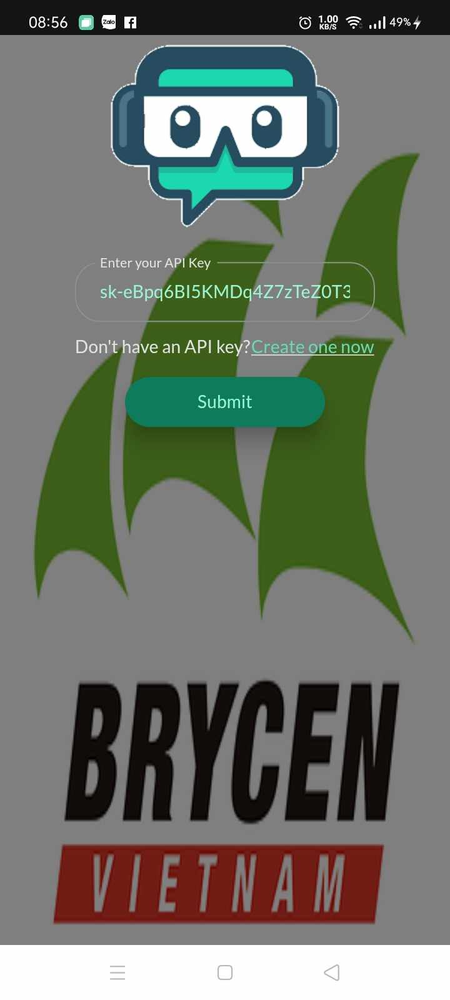
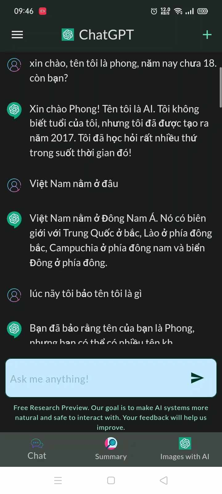
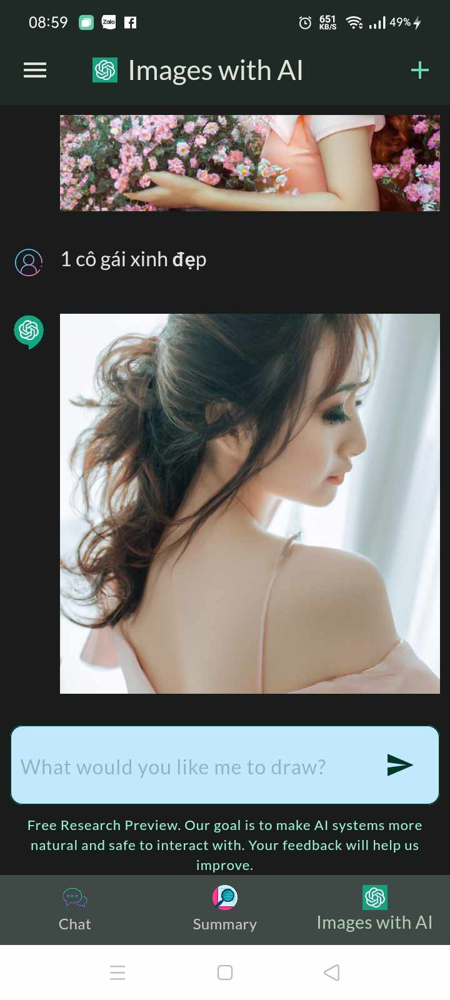
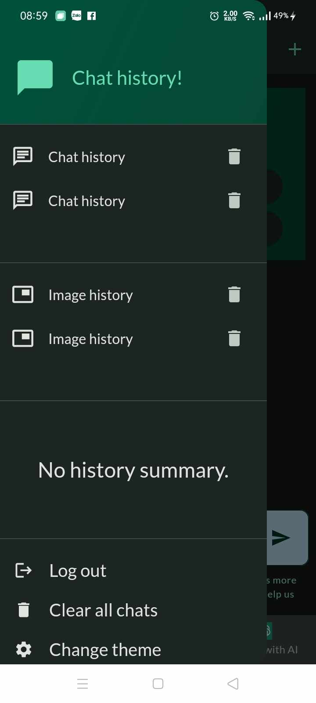
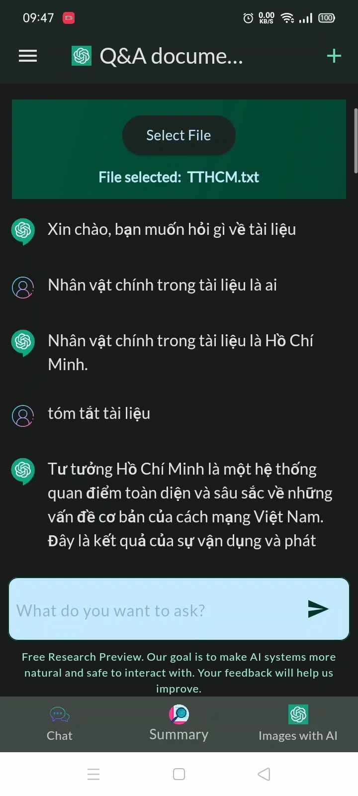
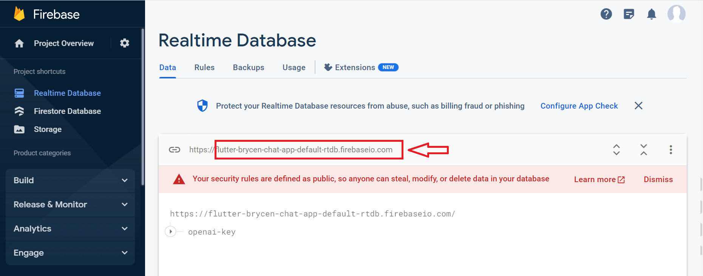
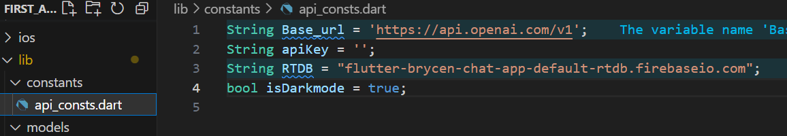

# GPT-3.5 Powered Chatbox with Flutter

Welcome to the GPT-3.5 Powered Chatbox project! This Flutter application leverages the power of OpenAI's GPT-3.5 API to create a chatbot that engages in natural language conversations. Users can also create images, generate summaries, view conversation history, and enjoy real-time interactions.

## Features

- **Natural Language Chat:** Engage in fluid conversations with the GPT-3 powered chatbot.
- **Image Generation:** Command the chatbot to create images based on textual descriptions.
- **Conversation Summaries:** Generate summaries of long conversations to capture key points.
- **Chat History:** Maintain a history of conversations for reference and review.
- **Firebase Integration:** Store chat histories and summaries in Firebase Firestore for seamless synchronization.
- **State Management:** Utilize the Provider package for efficient state management.
## Screenshots

| Video                                        | Home Screen                                  | Chat Screen                                  |
|----------------------------------------------|----------------------------------------------|----------------------------------------------|
| ([assets/screen/video.mp4](https://github.com/lebatuanphong5398/flutter_chatgpt/blob/6907feb262d6841e7fda9bf88673ca03490574df/assets/screen/video.mp4))      | |               |

| Image Screen                                 | Chat History                                 | Summary screen                                |
|----------------------------------------------|----------------------------------------------|----------------------------------------------|
||      |     |

## Getting Started

To experience the power of the GPT-3.5 Chatbox on your local machine, follow these steps:

1. Clone this repository: `https://github.com/lebatuanphong5398/flutter_chatgpt.git`
2. Navigate to the project directory: `cd flutter_chatgpt`
3. Install dependencies: `flutter pub get`
4. [Set up Firebase](#Setting-up-Firebase)
5. Run the app: `flutter run`

### Setting up Firebase 

   This chatbox project integrates with Firebase for real-time chat history and summaries. Here's how to set up Firebase for your project:
   
   After downloading this repository, you need to configure Firebase to save your data. Follow these steps:

#### Step 1: Configuring Firebase

   To set up Firebase for your project, you'll need the Firebase CLI. Here's how to install and use it:
   1. If you haven't already, [install the Firebase CLI](https://firebase.google.com/docs/cli#setup_update_cli).
   2. Log into Firebase using your Google account by running the following command:
      `firebase login`
   3. Install the FlutterFire CLI by running the following command from any directory:
      <pre>dart pub global activate flutterfire_cli</pre>
   4. Configure your apps to use Firebase:`flutterfire configure`

#### Step 2: Create a Firebase Project

   1. Go to the [Firebase Console](https://console.firebase.google.com/).
   2. Click on the "Add project" button.
   3. Follow the prompts to set up your project, giving it a name and selecting your preferred analytics settings.

#### Step 3: Adjust the rules and update the link

   Navigate to the Realtime Database, Firestore Database, and Storage, then modify the rules from 'false' to 'true'. Particularly in the Realtime Database section, you need to copy the Realtime Database link and paste it into the 'constants' file in my code.
| Screenshot 1                                 | Screenshot 2                                 |
|----------------------------------------------|----------------------------------------------|
|        |    | 

## Technologies Used

- Flutter: A versatile UI toolkit for crafting natively compiled applications.
- OpenAI GPT-3.5 API: Powering the natural language interactions within the chatbox.
- Firebase: Providing backend services including authentication and Firestore database.
- Provider: A recommended state management solution for Flutter apps.

## Contributing

Contributions are welcome! Feel free to submit issues and pull requests to help improve the project.

Experience the future of chatbots with GPT-3.5 and Flutter!
